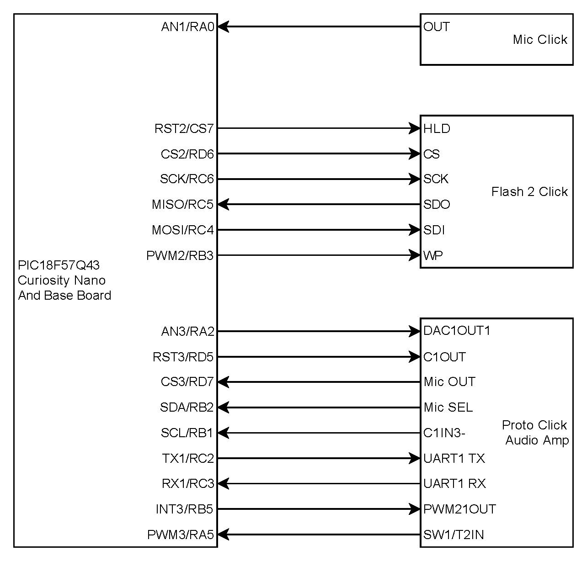
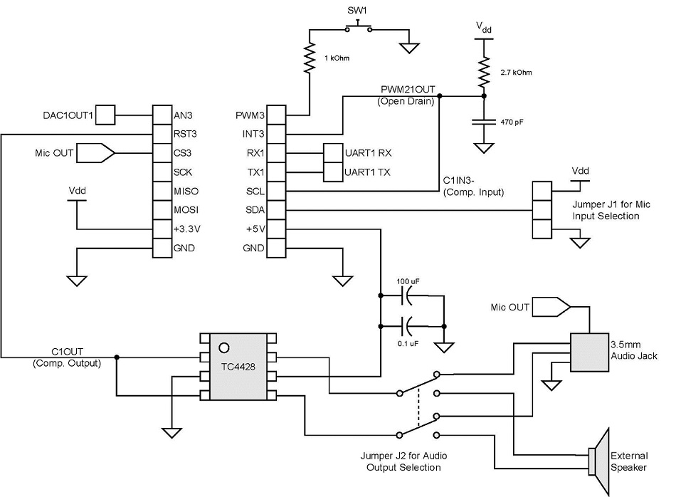

# pic18f57q43-audio-record-playback ReadMe

## Audio Recording and Playback using DMA and CIPs

This demo is based on the PIC18F57Q43 Curiosity Nano platform. It details the usage of ADC for sound recording, SPI for interfacing with the external memory module, DAC for playback, DMA for data transfers, and the use of timers to define sampling frequency. The application also demonstrates the use of Timer2 HLT and CLC for switch debouncing, and the Comparator and PWM for class D power amplification.

## Related Documentation

An application note explaining the theory of operation and details of hardware and software design will be published soon.

## Software Used

- MPLAB® X IDE 5.30 or newer [(microchip.com/mplab/mplab-x-ide)](http://www.microchip.com/mplab/mplab-x-ide)
- MPLAB® XC8 2.10 or a newer compiler [(microchip.com/mplab/compilers)](http://www.microchip.com/mplab/compilers)
- MPLAB® Code Configurator (MCC) 3.95.0 or newer [(microchip.com/mplab/mplab-code-configurator)](https://www.microchip.com/mplab/mplab-code-configurator)
- MPLAB® Code Configurator (MCC) Device Libraries PIC10 / PIC12 / PIC16 / PIC18 MCUs [(microchip.com/mplab/mplab-code-configurator)](https://www.microchip.com/mplab/mplab-code-configurator)
- Microchip PIC18F-Q Series Device Support (1.4.109) or newer [(packs.download.microchip.com/)](https://packs.download.microchip.com/) 

## Hardware Used

- PIC18F57Q43 Curiosity Nano Evaluation Kit [(DM164150)](https://www.microchip.com/developmenttools/ProductDetails/DM164150 "(DM164150)")
- Curiosity Nano Base for Click boards™ [(AC164162)](https://www.microchip.com/developmenttools/ProductDetails/AC164162 "(AC164162)")
- Mic Click [[MIKROE-2563]](https://www.mikroe.com/mic-click "[MIKROE-2563]")
- Flash 2 Click [[MIKROE-2267]](https://www.mikroe.com/flash-2-click "[MIKROE-2267]")
- Power Amplifier implemented on a PROTO Click [[MIKROE-1507]](https://www.mikroe.com/proto-click "[MIKROE-1507]")

## Hardware Setup

The necessary connections between the PIC18F57Q43 Curiosity Nano board and the required click boards are shown below:
- The Click 1 expansion connects to the Mic click board. This uses the AN1 pin to transfer analog voice signal to the ADC on-board the PIC18F57Q43. The Mic click has a signal conditioning and filtering circuit on board.
- The Click 2 expansion connects to the Flash 2 click board. This board has the SST26VF064B Flash memory chip by Microchip and uses SPI to communicate with the microcontroller.
- The Click 3 expansion connects to a custom made Class D power amplifier circuit on a PROTO Click.

### Curiosity Nano Board Connections

### PROTO Click Circuit

### Full System Setup

## Software Setup

MCC is used to configure the following. Refer to the MPLAB X project for details and settings for each component.

- System setup - CPU and Interrupts
- TMR0 - used to generate 10 kHz sampling timer
- ADCC - used for sampling and quantization of analog audio signal
- DAC1 - used to output the analog audio signal
- SPI1 - used to communicate with external memory module
- DMA (DMA1, DMA2, DMA3, DMA4, DMA5, DMA6) - data transfer operations
- PWM1 - used to create a sawtooth waveform for the audio amplifier
- CMP1 - used to compare sawtooth waveform with DC-offset DAC output to produce PWM signal to drive the audio speaker
- TMR2/4 - along with CLC1/2, are used to debounce buttons
- CLC1/2 - along with TMR2/4, are used to debounce buttons
- UART1 - used for sending and receiving debug messages

## Operation

To run the application, use the button on the Curiosity Nano board.
- By default, the application is in "Idle" mode.
- Double press the button to enter "Record" mode. The system will keep recording until the button is pressed again to stop, or it runs out of memory. If an external memory is present, recording will be stored there. Otherwise the recording will be stored in internal flash memory.
- Press the button once to enter "Playback" mode. The system will keep playing the recorded audio stored in the memory until the button is pressed again to stop, or if the entire recording is played.
- Long press the button to enter "Erase" mode and erase the entire recording from the memory.

A special button is available on the PROTO Click along with the amplifier. Long press this button to enter "Passthrough" mode in which the system acts as a simple amplifier and does not record and store the audio. Press this special button again to leave the "Passthrough" mode.

The audio will be played through the class D amplifier on PROTO Click. Use the onboard speaker to hear the audio playback, or hook up an external speaker and switch the jumpers.

## Summary

The DMA is a great way to transfer data between registers, RAM and Flash in different configurations. It allows for speed and ease of use, in addition to freeing up the CPU to perform other tasks.

The DAC allows for much better reproduction of sampled audio signals because of the higher 8-bit resolution. The buffered output of the DAC forms a great connection to different peripherals directly, without degrading the signal. This can be used along with the PWM and Comparator to form an excellent class D power amplifier.

Timer2 HLT can be combined with CLC for an excellent code-free switch debouncing technique.
